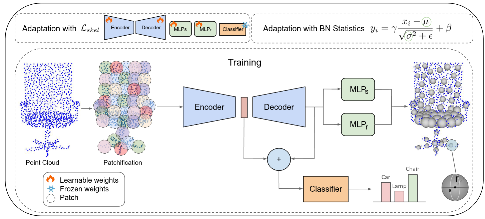

<h1>SMART-PC - ICML 2025 🎉 </h1>
<h3>Skeletal Model Adaptation for Robust Test-Time Training in Point Clouds</h3>

📄 [Paper Link on arXiv](https://arxiv.org/pdf/2503.04953)

## Abstract

Test Time Training has emerged as a promising solution to address distribution shifts in 3D point cloud classification. However, existing methods often rely on computationally expensive backpropagation during adaptation, limiting their applicability in real-world, time-sensitive scenarios. In this paper, we introduce SMART-PC, a skeleton-based framework that enhances resilience to corruptions by leveraging the geometric structure of 3D point clouds. During pre-training, our method predicts skeletal representations, enabling the model to extract robust and meaningful geometric features that are less sensitive to corruptions, thereby improving adaptability to test-time distribution shifts.
Unlike prior approaches, SMART-PC achieves real-time adaptation by eliminating backpropagation and updating only BatchNorm statistics, resulting in a lightweight and efficient framework capable of achieving high frame-per-second rates while maintaining superior classification performance. Extensive experiments on benchmark datasets, including ModelNet40-C, ShapeNet-C, and ScanObjectNN-C, demonstrate that SMART-PC achieves state-of-the-art results, outperforming existing methods such as MATE in terms of both accuracy and computational efficiency.


## Overview

<div  align="center">    
 
</div>


# Preparation

## Requirements
```
PyTorch >= 1.7.0 < 1.11.0  
python >= 3.7  
CUDA >= 9.0  
GCC >= 4.9  
```
To install all additional requirements (open command line and run):
```
pip install -r requirements.txt

cd ./extensions/chamfer_dist
python setup.py install --user

cd ..

cd ./extensions/emd
python setup.py install --user
pip install "git+https://github.com/erikwijmans/Pointnet2_PyTorch.git#egg=pointnet2_ops&subdirectory=pointnet2_ops_lib"
pip install --upgrade https://github.com/unlimblue/KNN_CUDA/releases/download/0.2/KNN_CUDA-0.2-py3-none-any.whl
```

## Data Preparation
Our code currently supports three different datasets: [ModelNet40](https://arxiv.org/abs/1406.5670), [ShapeNetCore](https://arxiv.org/abs/1512.03012) and [ScanObjectNN](https://arxiv.org/abs/1908.04616).

### First Method: Create Corrupted Datasets 
  
#### 1. Download Clean Datasets
To use these datasets with our code, first download them from the following sources:  
- [ModelNet](https://shapenet.cs.stanford.edu/media/modelnet40_normal_resampled.zip) 

- [ShapeNetCore](https://cloud.tsinghua.edu.cn/f/06a3c383dc474179b97d/)

- [ScanObjectNN](https://hkust-vgd.ust.hk/scanobjectnn/h5_files.zip) (It is necessary to first agree to the terms of use [here](https://forms.gle/g29a6qSgjatjb1vZ6))  

Then, extract all of these folders into the same directory for easier use.

#### 2. Adding corruptions to the data
To add distribution shifts to the data, corruptions from [ModelNet40-C](https://arxiv.org/abs/2201.12296) are used.  
For experiments on corrupted ModelNet data, the ModelNet40-C dataset can be downloaded [here](https://drive.google.com/drive/folders/10YeQRh92r_WdL-Dnog2zQfFr03UW4qXX).  
Compute the same corruptions for ShapeNetCore and ScanObjectNN, if needed.

```
python ./datasets/create_corrupted_dataset.py --main_path <path/to/dataset/parent/directory> --dataset <dataset_name>
```
Replace `<dataset_name>` with either `scanobjectnn` or `shapenet` as required. 

Note that for computation of the corruptions "occlusion" and "lidar", model 
meshes are needed. These are computed with 
the [open3d](http://www.open3d.org/docs/release/getting_started.html) library. 

### Second  Method: Download Corrupted Datasets 
You can download the corrupted datasets from the following [Google Drive link](https://drive.google.com/drive/folders/1v2VP-K0x0TIsPjpmJox6j-CgVPMLhe6Q?usp=sharing).


## Acknowledgement

This project is based on Point-MAE ([paper](https://arxiv.org/abs/2203.06604), [code](https://github.com/Pang-Yatian/Point-MAE)), MATE ([paper](https://arxiv.org/pdf/2211.11432), [code](https://github.com/jmiemirza/MATE/tree/master)). Thanks for their wonderful works.


